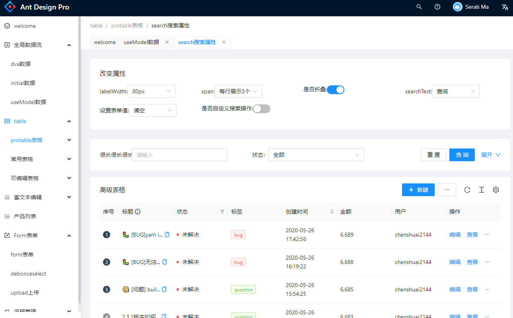

<h1 align="center">Ant Design Pro项目常用组件封装</h1>

<div align="center">

  <p>5.0版本</p>

  <!--  -->

</div>

## 官网地址:

https://pro.ant.design/zh-CN/

## 组件

```
- 全局数据管理
  - dva
  - initialstate
  - useModel
- protable表格
  - search
  - span表格合并
  - edittable可编辑表格
- Form表单
  - debounce
  - upload
- 流程图
  - 新建流程
  - 流程列表
- Result
  - Success
  - Failed
- Exception
  - 403
  - 404
  - 500
- User
  - Login
  - Register
  - Register Result
```

## Usage

### Use bash

```bash
$ git clone https://github.com/shengbid/antdpro-demo.git  或者下载zip
$ 安装依赖 yarn
$ 启动项目 yarn start  # visit http://localhost:8000

```

### 所有功能博客有详细介绍 https://www.cnblogs.com/steamed-twisted-roll/category/1779612.html
